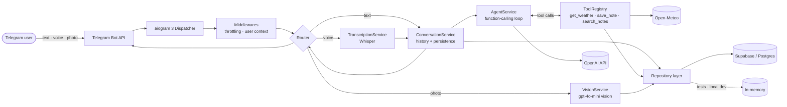

# Telegram AI Assistant — Starter

[](https://github.com/asdefg13/telegram-ai-assistant-starter/actions/workflows/ci.yml)
[](https://www.python.org/)
[](https://docs.aiogram.dev/)
[](https://platform.openai.com/docs/guides/function-calling)
[](https://supabase.com/)
[](https://docs.docker.com/compose/)
[](https://docs.astral.sh/ruff/)
[](LICENSE)

A production-shaped Telegram assistant: an **OpenAI function-calling agent** with three
tools, **Whisper** voice input, **vision** for photos, and a **Supabase**-backed
repository layer — packaged with Docker, tests and CI.

> **Reference implementation, extracted from my production projects.** The structure,
> boundaries and failure handling are what I ship for clients; the business logic has
> been replaced with a small, self-contained demo domain (weather + notes).

Add your own `BOT_TOKEN` and `OPENAI_API_KEY` and it runs — no other setup required.

---

## Architecture



### Why it is shaped this way

| Decision | Reason |
| --- | --- |
| Repository interfaces in `app/storage/base.py` | Handlers never import a database client. Swapping Supabase for plain Postgres is one line in `build_repositories`. |
| `ConversationService` between aiogram and the agent | Transport code stays thin; the interesting logic is testable without Telegram. |
| Tools as classes with their own JSON schema | Adding a capability means adding one file — the agent loop never changes. |
| Tool errors returned as strings, never raised | The model sees the failure as a tool result and can recover on the next iteration. |
| `max_iterations` on the agent loop | A confused model cannot burn budget in an infinite tool cycle. |
| Composition root in `app/bot.py` | One place builds every client; everything else receives dependencies. |
| Turns persisted *after* the model call | A failed request does not poison the conversation history. |

---

## What the bot does

| Input | Path |
| --- | --- |
| Text | → agent → tools → answer |
| Voice note | download → Whisper → agent → answer (transcript echoed back) |
| Photo | download largest size → vision model → answer, stored as conversation context |
| `/start`, `/help` | Static onboarding |
| `/reset` | Clears conversation history, keeps notes |

**Agent tools**

| Tool | Description |
| --- | --- |
| `get_weather(city, units)` | Live conditions via Open-Meteo — no API key needed |
| `save_note(text, tags)` | Persists a fact the user asked to remember |
| `search_notes(query, limit)` | Recalls earlier notes before the model answers from memory |

Try it: *“remember that my landlord is called Ana”* → later → *“who is my landlord?”*

---

## Quick start

```bash
git clone https://github.com/asdefg13/telegram-ai-assistant-starter.git
cd telegram-ai-assistant-starter
cp .env.example .env      # fill in BOT_TOKEN and OPENAI_API_KEY
```

**Zero-infrastructure run** (in-memory storage, nothing to install but Python):

```bash
python -m venv .venv && source .venv/bin/activate
pip install -e ".[dev]"
STORAGE_BACKEND=memory python -m app.main
```

**With Supabase** — create a project, run [`supabase/schema.sql`](supabase/schema.sql) in the
SQL editor, put the project URL and `service_role` key in `.env`, then:

```bash
pip install -e ".[supabase]"
python -m app.main
```

**With Docker**:

```bash
docker compose up --build -d
```

```bash
docker compose logs -f bot
```

---

## Configuration

Every variable lives in [`.env.example`](.env.example). Settings are parsed and validated
once at boot by `app/config.py`, so a misconfigured deployment fails immediately with a
readable error rather than at the first user message.

| Variable | Default | Notes |
| --- | --- | --- |
| `BOT_TOKEN` | — | From [@BotFather](https://t.me/BotFather) |
| `OPENAI_API_KEY` | — | Required |
| `OPENAI_MODEL` | `gpt-4o-mini` | Chat + function calling |
| `OPENAI_VISION_MODEL` | `gpt-4o-mini` | Photo understanding |
| `OPENAI_TRANSCRIPTION_MODEL` | `whisper-1` | Voice notes |
| `STORAGE_BACKEND` | `supabase` | `supabase` or `memory` |
| `SUPABASE_URL` / `SUPABASE_SERVICE_KEY` | — | Required when the backend is `supabase` |
| `HISTORY_LIMIT` | `12` | Messages replayed into model context |
| `AGENT_MAX_ITERATIONS` | `5` | Tool-loop safety valve |
| `RATE_LIMIT_SECONDS` | `0.7` | Minimum gap between messages per user |
| `LOG_LEVEL` | `INFO` | |

> No key, token, project ref or chat ID is committed anywhere in this repository —
> only `.env.example` placeholders.

---

## Project layout

```
app/
├── main.py                  # entrypoint, graceful shutdown
├── bot.py                   # composition root — builds every dependency once
├── config.py                # pydantic-settings, validated at boot
├── handlers/                # commands · text · voice · photo
├── middlewares/             # throttling · user context
├── services/
│   ├── agent.py             # OpenAI function-calling loop
│   ├── conversation.py      # history + persistence around the agent
│   ├── transcription.py     # Whisper
│   ├── vision.py            # image understanding
│   └── tools/               # base + registry + the three tools
├── storage/
│   ├── base.py              # repository interfaces
│   ├── memory_repo.py       # in-memory implementation
│   └── supabase_repo.py     # Supabase implementation
└── utils/                   # logging · downloads · Telegram limits
supabase/schema.sql          # tables, indexes, RLS
tests/                       # 53 tests, fully mocked transports
```

---

## Adding a tool

One file, one registration line — the agent loop is untouched:

```python
# app/services/tools/crm.py
from app.services.tools.base import Tool, ToolContext


class CreateLeadTool(Tool):
    name = "create_lead"
    description = "Create a lead in the CRM when the user asks to be contacted."
    parameters = {
        "type": "object",
        "properties": {
            "name": {"type": "string"},
            "email": {"type": "string"},
        },
        "required": ["name", "email"],
        "additionalProperties": False,
    }

    async def run(self, ctx: ToolContext, **kwargs) -> str:
        ...
        return "Lead created."
```

```python
# app/services/tools/__init__.py
return ToolRegistry(
    [GetWeatherTool(http_client), SaveNoteTool(), SearchNotesTool(), CreateLeadTool()]
)
```

---

## Tests

```bash
pytest -q
```

53 tests, no network and no credentials: Telegram, OpenAI, HTTP and the database are all
mocked, and storage runs on the in-memory repositories.

| Suite | Covers |
| --- | --- |
| `test_agent.py` | Tool dispatch, parallel calls, history replay, iteration cap |
| `test_tools.py` | Schemas, note round-trip, malformed arguments, upstream failures |
| `test_handlers_*.py` | Command replies, typing indicator, message splitting, voice and photo paths |
| `test_conversation.py` | Persistence, history windowing, failure isolation |
| `test_repositories.py` | The contract every repository implementation must honour |
| `test_config.py` | Misconfiguration fails at boot, not at runtime |

CI runs `ruff check`, `ruff format --check` and `pytest` on Python 3.11 and 3.12.

---

## Production notes

- **Long polling** is the default because it needs no inbound port. For webhooks, swap
  `start_polling` in `app/main.py` for aiogram's `SimplePollingRequestHandler`/aiohttp setup.
- **Throttling** is in-process. With more than one replica, back `ThrottlingMiddleware`
  with Redis.
- **RLS is on** for every Supabase table with no permissive policy: the bot connects with
  the `service_role` key and is the only writer.
- **The Supabase client is synchronous**, so every call is dispatched with
  `asyncio.to_thread` and the event loop stays free.
- **Voice notes are OGG/Opus** and the OpenAI audio endpoint accepts them directly — no
  ffmpeg step in the image.

---

## Hire me

I build production AI systems: Telegram bots, LLM agents with tool use, and n8n
automation pipelines. Python / FastAPI / aiogram / OpenAI / Claude / Supabase.

**[→ Hire me on Upwork](https://www.upwork.com/freelancers/~01c8a4f2b80b03bae6)**

---

## License

[MIT](LICENSE)
